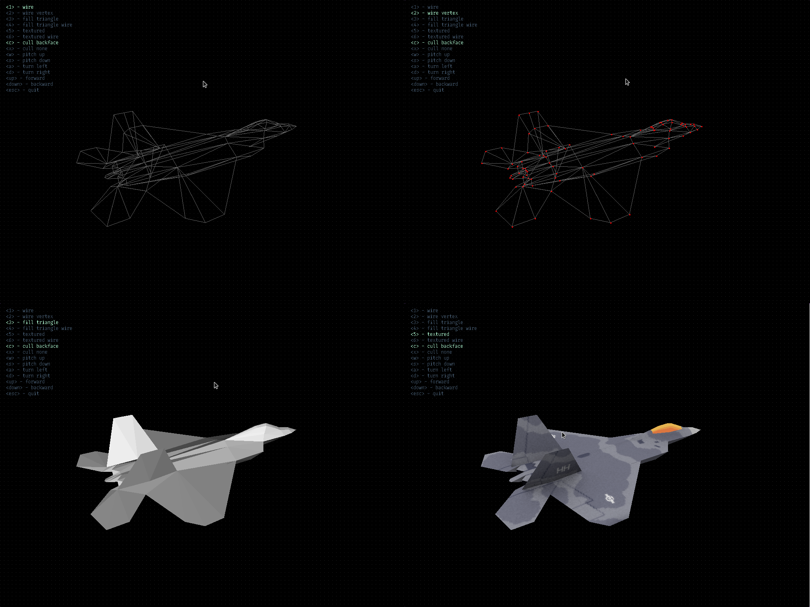

# 3d-renderer

[](https://github.com/claudemuller/3d-renderer/actions/workflows/c.yml)

A software 3D renderer written in C and SDL using the left-handed co-ordinate system.



## Requirements

- [gcc](https://gcc.gnu.org/)
- or [clang](https://clang.llvm.org/)
- [make](https://www.gnu.org/software/make/)
- [SDL2](https://www.libsdl.org/)
- (Optional) [Bear](https://github.com/rizsotto/Bear) - for auto-completion (in the editor)

## Generate Compilation Database (for auto-completion)

```bash
make gen-compilation-db
```

## Building

```bash
make build
```

## Running

```bash
make run
```

## Build a Debug Binary

```bash
make debug-build
```

## Start `lldb` or `gdb` With Debug Binary

```bash
make debug
```

## Cleaning the Project

```bash
make clean
```

---

> References
>
> Code produced as part of the course [3D Graphics Programming from Scratch](https://courses.pikuma.com/courses/take/learn-computer-graphics-programming).
